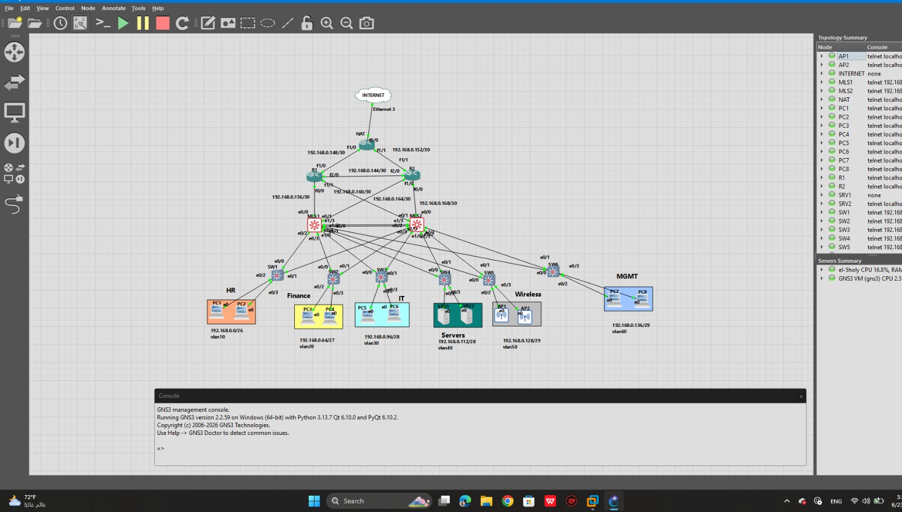

# Enterprise Network Infrastructure Lab

# Enterprise Network Infrastructure Lab

<p align="center">


</p>

---

## Table of Contents

- [Project Overview](#project-overview)
- [Enterprise Network Topology](#enterprise-network-topology)
- [Technologies Used](#technologies-used)
- [Implemented Features](#implemented-features)
- [VLAN Information](#vlan-information)
- [High Availability](#high-availability)
- [Dynamic Routing](#dynamic-routing)
- [DHCP Services](#dhcp-services)
- [Internet Connectivity](#internet-connectivity)
- [Security](#security)
- [Validation](#validation)
- [Repository Structure](#repository-structure)
- [Skills Demonstrated](#skills-demonstrated)
- [Future Improvements](#future-improvements)

---

## Enterprise Network Topology

<p align="center">
  
</p>

---

# Project Overview

This project simulates a real-world enterprise network infrastructure using Cisco IOS devices in GNS3 integrated with Windows Server 2019.

The environment was designed to demonstrate enterprise routing, switching, redundancy, centralized DHCP services, network segmentation, security policies, and Internet connectivity.

The project combines multiple CCNA and Enterprise Networking technologies into a single integrated production-style topology.

---

# Enterprise Architecture

```
                    Internet
                        │
                     NAT Router
                        │
                 OSPF Core Routers
                  /             \
              MLS1             MLS2
             / |  \           / |  \
      Access Switches     Access Switches
            │                 │
        End Devices      Servers / APs
```

---

---

# Technologies Used

- Cisco IOS
- GNS3
- VMware Workstation
- Windows Server 2019

---

# Implemented Features

## Layer 2

- VLAN Segmentation
- VTP
- Spanning Tree Protocol (STP)
- EtherChannel

## Layer 3

- Inter-VLAN Routing
- OSPF Dynamic Routing
- HSRP First Hop Redundancy

## Services

- Windows Server 2019 DHCP
- DHCP Relay (IP Helper)
- NAT Overload (PAT)

## Security

- Extended ACLs
- VLAN Isolation

---

# VLAN Information

| VLAN | Department | Network |
|------|------------|----------------|
|10|HR|192.168.0.0/26|
|20|Finance|192.168.0.64/27|
|30|IT|192.168.0.96/28|
|40|Servers|192.168.0.112/28|
|50|Wireless|192.168.0.128/29|
|60|Management|192.168.0.136/29|

---

# High Availability

Implemented HSRP between two Multilayer Switches.

Features

- Active / Standby Gateway
- Gateway Redundancy
- Automatic Failover
- Preemption

---

# Dynamic Routing

Implemented OSPF for routing between enterprise routers.

Features

- Dynamic Route Exchange
- Fast Convergence
- Redundant Paths

---

# DHCP Services

Windows Server 2019 provides

- Centralized DHCP
- Multiple DHCP Scopes
- DHCP Relay using IP Helper Address

---

# Internet Connectivity

Internet access is provided through

- NAT Overload (PAT)
- Default Route Advertisement
- Enterprise Edge Router

---

# Security

Implemented Extended ACLs to restrict communication between departments while maintaining access to enterprise services.

---

# Validation

The following functionality has been successfully tested.

## Validation Screenshots

### HSRP

<p align="center">
  
</p>

### OSPF

<p align="center">
  
</p>

### NAT

<p align="center">
  
</p>

### DHCP

<p align="center">
  
</p>

### ACL

<p align="center">
  
</p>
---

# Repository Structure

```
Configurations/
GNS3-Project/
Topology/
Verification/
Windows-Server/
README.md
```

---

# Skills Demonstrated

- Enterprise Network Design
- Routing & Switching
- Cisco IOS Configuration
- High Availability
- Dynamic Routing
- Network Security
- Windows Server Administration
- DHCP Deployment
- Enterprise Troubleshooting

---

# Future Improvements

- Multi-Area OSPF
- Route Summarization
- Stub Areas
- IPv6
- BGP
- FortiGate Integration
- Syslog Server
- NTP Server
- SNMP Monitoring

---

# Author

**Mohamed Mahmoud Elkholy**

CCNA | Enterprise Networking | Windows Server

Open to Networking & IT Infrastructure Opportunities.
